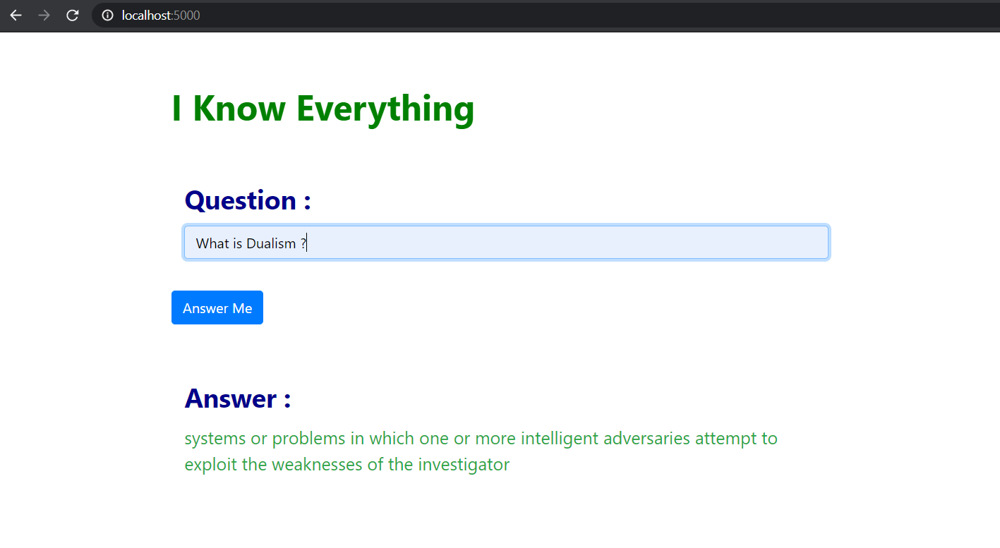

# Image of the App "I Know Everything"



# Model used BERT-Large Uncased

Pre-Trained on SQuAD Dataset. 

Used google BERT to build this Question_Answering System.


# Requirements
- python3
- pip3 install -r requirements.txt


# Result
`model` : bert-large-uncased-whole-word-masking 
```json
{"exact_match": 86.91579943235573, "f1": 93.1532499015869}
```

## Pretrained model download from [here](https://drive.google.com/open?id=1NZ8jprb4ON0guBd7t172HMAT4JBHc5Cy)
unzip and move files to model directory
